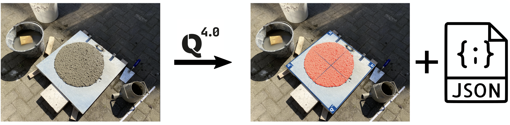
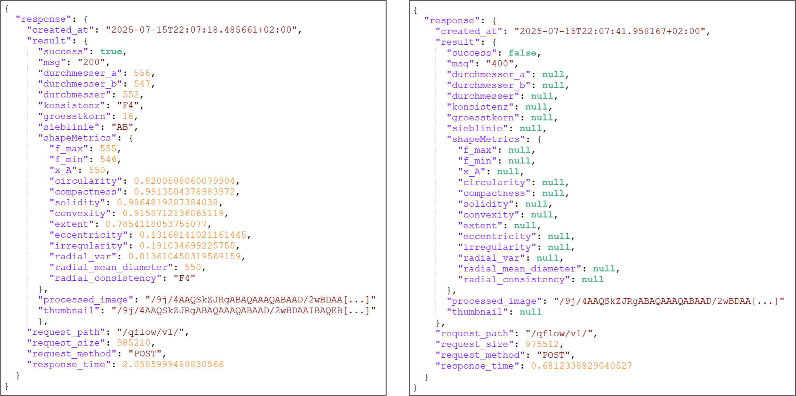
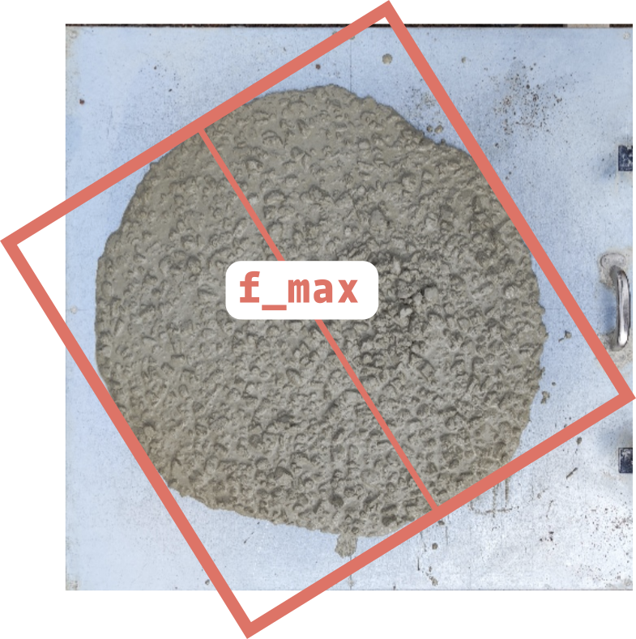
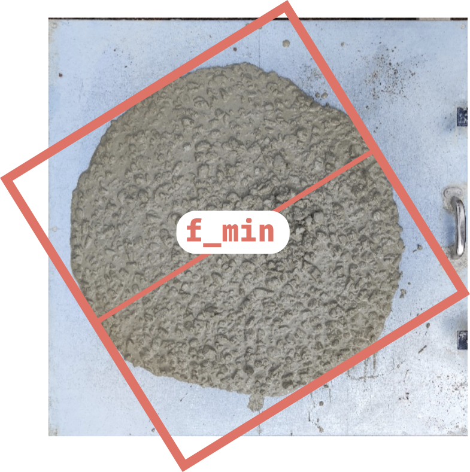

# Qflow-API - Benutzerdokumentation -

## Hinweise für Entwickler
Die Schnittstelle ist eine REST-API, die den Zugriff über einen POST-Request ermöglicht. Für jede Anfrage sind folgende Angaben erforderlich:

- Endpoint: Die URL der API, z. B.: <mark>https://your-api-endpoint.com/api/v1/model/</mark>
- Authentifizierung: Ein gültiger Bearer Token, der im HTTP-Header als <mark>Authorization</mark> übergeben wird.
Zum Erhalt des Endpoint-Zugangs sowie einer gültigen Authentifizierung kontaktieren Sie bitte das Team von conQrete! 

⚠️ Hinweis: Der Token ist __vertraulich__ zu behandeln und darf nicht öffentlich geteilt oder im Frontend-Code hardcodiert werden.

Beispielaufruf mit <mark>curl</mark>:
```bash
curl -X POST "https://api.conqrete.tech/MODEL NAME/VERSION/" \
     -H "Authorization: Bearer YOUR_API_KEY" \
     -F "image=@path/to/your/image.jpg;type=image/jpeg"
```

Beispielaufruf mit <mark>Python</mark>:
```python
import requests

# Replace with your API details
API_URL = "https://api.conqrete.tech/MODEL NAME/VERSION/"
API_KEY = 'YOUR_API_KEY'

image_path = "path/to/your/image.jpg"

with open(image_path, "rb") as image_file:
    response = requests.post(
        API_URL,
        headers={'Authorization': f'Bearer {API_KEY}'},
        files={'image': ('image.jpg', image_file, 'image/jpeg')}, 
    )
# Print result
try:
    print(response.json())
except ValueError:
    print(response.text)
```

Wir empfehlen die Übermittlung von Bilddaten im **JPEG Format** in UltraXGA **(1600x1200, 4:3)** oder in Full-HD Auflösung **(1920 x 1080, 16:9)**.

<br><br><br>

## Hinweise zur Anwendung
Ein einziges **Foto vom Ausbreitmaß** genügt und die conQrete-API ermittelt automatisch eine Vielzahl an Frischbetoneigenschaften. 

Die einzige Anforderung an die Bildaufnahme ist, dass der Ausbreittisch vollständig im Bild enthalten sein muss – andernfalls kann eine Ausbreitmaß-Analyse nicht stattfinden. Achten Sie also darauf, dass alle vier Ecken des Tisches im Bild zu sehen sind, z.B. so:



Als Ergebnis gibt die API eine Visualisierung der Ausbreitmaßanalyse sowie alle ermittelten Parameter der Frischbetoneigenschaften im JSON-Format zurück (Details siehe unten). 

Die Visualisierung kann für eine manuelle Plausibilitätsprüfung der Messung verwendet werden. Ein blauer Tischrahmen wird auf das Bild projiziert, welcher bei korrekt erfolgter Messung den Kanten des Ausbreittisches entsprechen sollte. Der Ausbreitkuchen wird eingefärbt und sollte dem Bereich entsprechen, welche für die Messung des Ausbreitmaßdurchmessers verwendet werden soll.

<br><br><br>

## Rückgabewerte und –format
Die REST-API gibt standardmäßig alle Antworten im **JSON-Format** zurück (JavaScript Object Notation). Unabhängig davon, ob eine Messung erfolgreich oder nicht-erfolgreich war, besteht jede API-Antwort aus folgenden Bestandteilen:



> <small>Abbildung 1: Beispiele für die zurückgegebenen Antworten der REST-API im JSON Format. Links: Beispiel für eine erfolgreiche Messung. Rechts: Beispiel für eine nicht-erfolgreiche Messung.</small>

#### Rückgabefelder im Detail:

| Feld       | Typ     | Beschreibung | Beispiel |
|------------|---------|--------------|----------|
| <span style="background-color:#fffb00;color:#000">response</span>| <span style="background-color:#fffb00;color:#000">object</span> | Objekt welches die gesamte zurückgegebene Antwort der API enthält |  |
| <span style="background-color:#fffb00;color:#000">created_at</span> | <span style="background-color:#fffb00;color:#000">string</span> | ISO 8601-formatierter Datums- und Zeitstempel |  |
| <span style="background-color:#fffb00;color:#000">result</span>  | <span style="background-color:#fffb00;color:#000">object</span> | Objekt, welches die Auswerteergebnisse des Ausbreitmaßes enthält |  |
| <span style="background-color:#fffb00;color:#000">success</span> | <span style="background-color:#fffb00;color:#000">boolean</span> | Gibt an, ob eine Messung stattgefunden hat (<span style="background-color:#fffb00;color:#000">true</span>) oder nicht (<span style="background-color:#fffb00;color:#000">false</span>), z. B. wenn kein Ausbreittisch im Bild vorhanden ist. |  |
| <span style="background-color:#fffb00;color:#000">msg</span>     | <span style="background-color:#fffb00;color:#000">string</span>  | Statusmeldung mit Details zum Erfolg/Fehlern:<br><span style="background-color:#fffb00;color:#000">200</span> – Messung erfolgreich<br><span style="background-color:#fffb00;color:#000">300</span> – kein Ausbreittisch im Bild gefunden<br><span style="background-color:#fffb00;color:#000">400</span> – Ausbreittisch nicht vollständig sichtbar (eine oder mehrere Ecken fehlen)<br><span style="background-color:#fffb00;color:#000">500</span> – Ausbreittisch gefunden, aber kein Betonkuchen detektiert |  |
|<span style="background-color:#fffb00;color:#000">durchmesser_a</span>| <span style="background-color:#fffb00;color:#000">float / null</span> | Durchmesser des Ausbreitkuchen [mm] entlang der einen Tischkante |  |
|<span style="background-color:#fffb00;color:#000">durchmesser_b</span>| <span style="background-color:#fffb00;color:#000">float / null</span> | Durchmesser des Ausbreitkuchen [mm] entlang der anderen Tischkante |  |
|<span style="background-color:#fffb00;color:#000">durchmesser</span>| <span style="background-color:#fffb00;color:#000">float / null</span> | Gemittelter Durchmesser [mm] aus <span style="background-color:#fffb00;color:#000">durchmesser_a</span> und <span style="background-color:#fffb00;color:#000">durchmesser_b</span> |  |
|<span style="background-color:#fffb00;color:#000">konsistenz</span>| <span style="background-color:#fffb00;color:#000">string (Enum) / null</span> | Gibt die aus dem durchmesser ermittelte Konsistenzklasse an. Mögliche Werte: <span style="background-color:#fffb00;color:#000">F1</span>, <span style="background-color:#fffb00;color:#000">F2</span>, <span style="background-color:#fffb00;color:#000">F3</span>, <span style="background-color:#fffb00;color:#000">F4</span>, <span style="background-color:#fffb00;color:#000">F5</span> und <span style="background-color:#fffb00;color:#000">F6</span> |  |
|<span style="background-color:#fffb00;color:#000">groesstkorn</span>| <span style="background-color:#fffb00;color:#000">int (Enum) / null</span> | Gibt das aus dem Bild ermittelte Größtkorn [mm] an. Mögliche Werte: 8, 16, 32 |  |
|<span style="background-color:#fffb00;color:#000">sieblinie</span>| <span style="background-color:#fffb00;color:#000">string (Enum) / null</span> | Gibt eine grobe Einschätzung der Siebline **(Achtung: dient nur als Richtwert, mit Ungenauigkeiten behaftet)**. Mögliche Werte: <span style="background-color:#fffb00;color:#000">A</span>, <span style="background-color:#fffb00;color:#000">AB</span>, <span style="background-color:#fffb00;color:#000">B</span>, <span style="background-color:#fffb00;color:#000">BC</span>, <span style="background-color:#fffb00;color:#000">C</span> |  |
|<span style="background-color:#fffb00;color:#000">shapeMetrics</span>| <span style="background-color:#fffb00;color:#000">object</span> | Objekt mit alternativen Beschreibungen des Durchmessers und zusätzlichen Form-Parametern, die die Form und Ausprägung des Ausbreitkuchens beschreiben |  |
|<span style="background-color:#fffb00;color:#000">.f_max</span> | <span style="background-color:#fffb00;color:#000">float / null</span> | Maximaler Durchmesser [mm] der um den Ausbreitkuchen gelegten rotierten best-fit Bounding Box. Entspricht der längeren Seite der Box. Kann abweichen von <span style="background-color:#fffb00;color:#000">durchmesser_a bzw</span>. <span style="background-color:#fffb00;color:#000">durchmesser_b</span>, je stärker die Form des Ausbreitkuchens von einem perfekten Kreis abweicht und je stärker die Orientierung des Ausbreitkuchens zu den Seiten des Tisches verdreht ist ||
| <span style="background-color:#fffb00;color:#000">.f_min</span>| <span style="background-color:#fffb00;color:#000">float / null</span> | wie <span style="background-color:#fffb00;color:#000">.f_max</span>, allerdings bezogen auf die kürzere Seite der rotierten Bounding Box |  |
| <span style="background-color:#fffb00;color:#000">durchmesser</span> | <span style="background-color:#fffb00;color:#000">float / null</span> | Gemittelter Durchmesser [mm] aus <span style="background-color:#fffb00;color:#000">durchmesser_a</span> und <span style="background-color:#fffb00;color:#000">durchmesser_b</span> | |
| <span style="background-color:#fffb00;color:#000">konsistenz</span> | <span style="background-color:#fffb00;color:#000">string (Enum) / null</span> | Gibt die aus dem <span style="background-color:#fffb00;color:#000">durchmesser</span> ermittelte Konsistenzklasse an. Mögliche Werte: <span style="background-color:#fffb00;color:#000">F1, F2, F3, F4, F5 und F6</span> | |
|<span style="background-color:#fffb00;color:#000">groesstkorn</span> | <span style="background-color:#fffb00;color:#000">int (Enum) / null</span> |Gibt das aus dem Bild ermittelte Größtkorn [mm] an. Mögliche Werte: <span style="background-color:#fffb00;color:#000">8, 16, 32</span>||
|<span style="background-color:#fffb00;color:#000">sieblinie</span> | <span style="background-color:#fffb00;color:#000">string (Enum) / null</span> |	Gibt eine grobe Einschätzung der Siebline **(Achtung: dient nur als Richtwert, mit Ungenauigkeiten behaftet)**. Mögliche Werte: <span style="background-color:#fffb00;color:#000">A, AB, B, BC, C</span> ||
|<span style="background-color:#fffb00;color:#000">shapeMetrics</span>|	<span style="background-color:#fffb00;color:#000">object</span> |	Objekt mit alternativen Beschreibungen des Durchmessers und zusätzlichen Form-Parametern, die die Form und Ausprägung des Ausbreitkuchens beschreiben ||